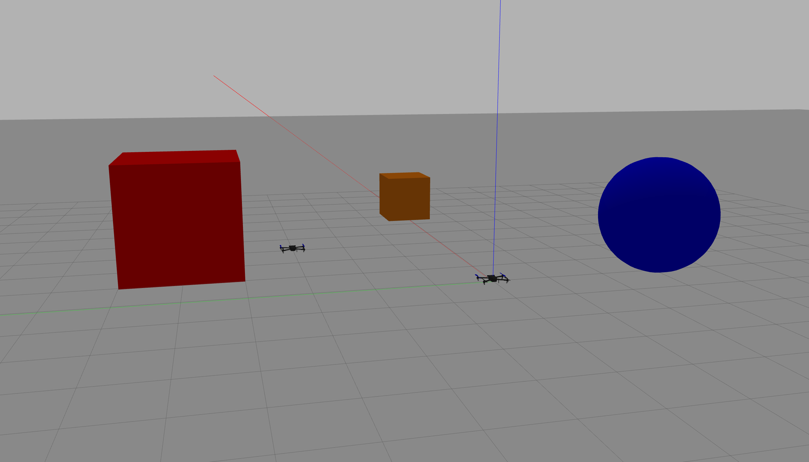
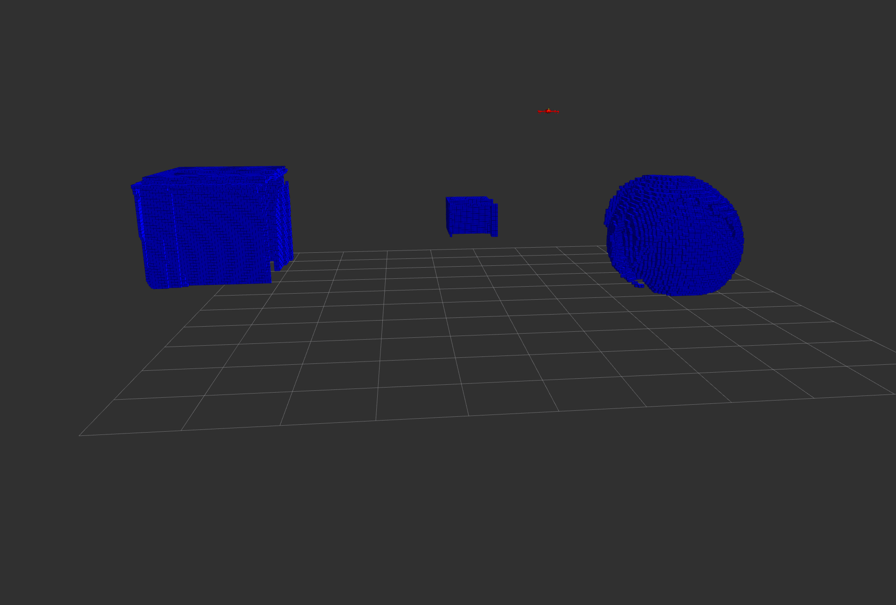

# <span style="color:blue"> **Cyber-Physical Systems Programming - Documentation**</span>

The main goal of this work is the following: in a Gazebo environment we need to create the instances of 2 drones, equipped with the required sensors, like a depth camera, in order to build a 3D map of the simulated environment and localize the position of the drones themselves (SLAM algorithm = Simultaneous Localization and Mapping). The tools we will employ are ROS 2 and PX4 Autopilot.

>Leonardo Bellini\
>Lorenzo Grandi\
>Lorenzo Squarzoni

The following notebook requires **Ubuntu 22.04 LTS** (Jammy Jellyfish) to be executed.

In the following document we'll try to explain all the steps required to execute a **Multiagent SITL SLAM**, based on two Iris drones equipped with a **depth camera**; the simulation will be carried out using Gazebo and Rviz2.

## <span style="color:lightgreen"> **Preliminary installations with ROS 2 Humble/Ubuntu 22.04**</span>

https://docs.ros.org/en/humble/Tutorials.html

https://docs.ros.org/en/humble/Installation/Ubuntu-Install-Debians.html


```python
!sudo apt install software-properties-common
!sudo add-apt-repository universe
```


```python
!sudo curl -sSL https://raw.githubusercontent.com/ros/rosdistro/master/ros.key -o /usr/share/keyrings/ros-archive-keyring.gpg
!echo "deb [arch=$(dpkg --print-architecture) signed-by=/usr/share/keyrings/ros-archive-keyring.gpg] http://packages.ros.org/ros2/ubuntu $(. /etc/os-release && echo $UBUNTU_CODENAME) main" | sudo tee /etc/apt/sources.list.d/ros2.list > /dev/null
```


```python
# ROS installation
!sudo apt update
!sudo apt upgrade
!sudo apt install ros-humble-desktop

!sudo apt install ros-dev-tools

# Gazebo installation
!sudo apt install libgazebo-dev
!sudo apt install ros-humble-gazebo-ros-pkgs
```


```python
# ALWAYS REMEMBER TO SOURCE THIS FILE (or add it in the .bashrc)
!source /opt/ros/humble/setup.bash

!echo "source /opt/ros/humble/setup.bash" >> ~/.bashrc # To append it to the .bashrc file
```

https://docs.px4.io/main/en/dev_setup/dev_env_linux_ubuntu.html#ros-2


```python
# Download PX4
!git clone https://github.com/PX4/PX4-Autopilot.git --recursive

# Install
!bash ./PX4-Autopilot/Tools/setup/ubuntu.sh -no-sim-tools --no-nuttx

# Then restart computer

# Additional dependencies
!sudo apt-get install protobuf-compiler libeigen3-dev libopencv-dev -y
```

### **.SDF to .URDF confersion of the iris model**

Since Rviz requires the drone's model to be in .urdf format, it is mandatory to convert the .sdf file of it to be readable.

The URDF files we'll use in the simulation are specific for each drone and are located in the */px4_pffboard/urdf* folder.

To show the drones' models in Rviz it is also required to take the **iris_depth_camera/meshes** folder from */px4_pffboard* and place it at the following address: *~/NAME_OF_YOUR_WORKSPACE/install/px4_offboard/share/px4_offboard*; this is not mandatory for the purpose of the simulation, but helps in better visualizing the process in Rviz.

## <span style="color:lightgreen"> **Single drone simulation with PX4 in Gazebo**</span>

### **Generic PX4 Gazebo simulation with IRIS drone**


```python
!cd PX4-Autopilot # Always make sure to be in this folder
!make px4_sitl gazebo-classic
```

### **PX4 Gazebo simulation with IRIS depth camera .urdf file**


```python
!cd PX4_Autopilot
!make px4_sitl gazebo_iris_depth_camera
```

These examples are generic and for testing purposes; in the final execution the models will be loaded from the launch file.

### **ROS2 and PX4 simulation baseline**

Our execution starts with a single launch file, located in the ros workspace, inside the */src/px4_offboard/launch directory*. This script is responsible for running all the processes and ros nodes we need to accomplish the simulation; in particular, one important script, *processes.py*, opens 2 terminals, one that runs the MicroXRCE agent and another responsible for launching the gazebo simulation. The other nodes and functions executed are Rviz and all the packages we will see in detail later.

The following code will be the baseline for our work. It is really important to correctly address the packages to execute.

Before starting, other tools need to be downloaded and installed, like MicroXRCE itself and px4_msgs:


```python
# Micro XRCE installation
!pip3 install --user -U empy pyros-genmsg setuptools
!pip3 install kconfiglib
!pip install --user jsonschema
!pip install --user jinja2

!git clone https://github.com/eProsima/Micro-XRCE-DDS-Agent.git
!cd Micro-XRCE-DDS-Agent
!mkdir build
!cd build
!cmake ..
!make
!sudo make install
!sudo ldconfig /usr/local/lib/
```


```python
# Inside the /ROS2_ws/src directory
!git clone https://github.com/PX4/px4_msgs.git

!cd ..
!pip install --user -U empy==3.3.4 pyros-genmsg setuptools
!colcon build
```

To use a different IRIS model file, as our .urdf one we need to change some lines in *~/NAME_OF_YOUR_WORKSPACE/src/ROS2_PX4_Offboard_Example/px4_offboard/px4_offboard/processes.py*:

> Run the PX4 SITL simulation \
> "cd ~/PX4-Autopilot && make px4_sitl gz_x500"

to:

> Run the PX4 SITL simulation \
> "cd ~/PX4-Autopilot && make px4_sitl gazebo-classic_iris_depth_camera__warehouse" # For the warehouse world \
> or \
> Run the PX4 SITL simulation \
> "cd ~/PX4-Autopilot && make px4_sitl gazebo-classic_iris_depth_camera__our_empty" # For our simple world


```python
# Source the code every time -> from ~/NAME_OF_YOUR_WORKSPACE
!source ./install/setup.bash
```

The simulation will be launched with all the required processes, to add new topics or nodes it will be easier to add the corresponding commands directly in the .launch file.


```python
# To run the simulation
!ros2 launch px4_offboard offboard_velocity_control.launch.py
```

At this point we are able to launch Gazebo and Rviz2 with a depth camera equipped drone, publishing the image of it and the associated point cloud that will be used to map the environment. At the beginning we mainly worked with a single drone, in order to understand the workflow required by ros and px4.

In our project we faced a problem with the ROS topic correct publishing, where the data related to the sensor wasn't correctly linked to the map frame, leading to an incompatibility between the sensor itself and the octomap library. To solve this issue we needed to manually publish the topics and link it to the map frame, with the correct transformation.

### **Map Frame publishing**


```python
# To execute the first script we need additional packages
!sudo apt install ros-humble-tf-transformations
!pip install --upgrade transforms3d
!pip install numpy==1.24

# From ~/NAME_OF_YOUR_WORKSPACE, when the simulation in Gazebo and Rviz is running
!source ./install/setup.bash
!ros2 run map_frame_publisher map_frame_publisher
```

The **map_frame_publisher** script creates the common map frame with respect to the world frame; it doesn't apply any rotation or translation between them.

### **Base_Link to Map transformation**


```python
# From ~/NAME_OF_YOUR_WORKSPACE, when the simulation in Gazebo and Rviz is running
!source ./install/setup.bash
!ros2 run map_base_link_publ map_base_link_publ
```

The **map_base_link_publ** script is extremely important, since it correctly connects the drones' specific frames to the common frame map: this operation has to be carried out in the right way to have a correct representation and visualization of the drones' positions in both gazebo and rviz2; since ROS2 and PX4 work with different coordinate systems it is mandatory to apply both translations and rotations between the frames, to move from an ENU system to a NED one: in our case we assigned the x value to y and viceversa and inverted the z axis, leading to the correct positioning of the frames. The second drone's position is obtained considering the initial offset between the two drones.

### **PointCloud publishing with respect to Map**

In addition we need to execute two more scripts in order to transform the pointcloud with respect to the map frame and use it for the mapping process:


```python
# From ~/NAME_OF_YOUR_WORKSPACE
!source ./install/setup.bash
!ros2 run pointcloud_transformer pointcloud_transformer
```

The first script, **pointcloud_transformer**, is responsible for correctly transforming the pointcloud coming from the drones' cameras with respect to the common frame map; for this no translations or rotations are required. 

This code is denser than the previous ones, because all the manipulations we have to apply to these topics are executed within it: the ground is removed applying a filter to all data below 0.2 meters in the z direction, the pointclouds are downsampled in order to speed up the transmittion of data and remove all possible delays and finally, based on the attitude topic of the drones, the data obtained when the drones are moving fast and rotating is removed, to avoid any drifting in the final octomap map; with a very little angle threshold we obtained a very good and clean result.

## <span style="color:lightgreen"> **Multiagent simulation with PX4 in Gazebo**</span>

### **PointCloud combining**

All the previous scripts were written and tested with a single drone; once their functioning was correct, we translated them to work with more than one agent. Other changes were done to move into a multiagent scenario, as we'll see in a minute.


```python
# From ~/NAME_OF_YOUR_WORKSPACE
!source ./install/setup.bash
!ros2 run pointcloud_combiner pointcloud_combiner
```

The final script, **pointcloud_combiner**, takes the two transformed and filtered pointclouds and joins them in one single topic, in order to feed it to the octomap process.

For ease, all these four executions will be added to the launch file.

### **OctoMap Mapping**

Version for ROS 2 Humble


```python
!sudo apt-get install ros-humble-octomap-mapping

!sudo nautilus # Command required too modify the launch file as needed
# The data will then be located at /opt/ros/humble/share/octomap_server/launch/ --> insert the topic "/pointcloud_wrt_map" and the frame_id as "map"

!ros2 launch octomap_server octomap_mapping.launch.xml # To launch the mapping
```

The mapping will be generated as a MarkerArray, specifically as a topic called */occupied_cells_vis_array*.

It is fundamental to insert the correct topic for the input pointcloud and the frame id into the octomap server launch file.

### **Multiagent files**

To make the multivehicle simulation possible, some files needs to be copied into the PX4 folder or changed:

from the */PX4_Files* folder take the files and place (replace the already exisiting files if present) them in the following folders:
- *sitl_multiple_run.sh* --> *~/PX4-Autopilot/Tools/simulation/gazebo-classic/*
- *jinja_gen.py* --> *~/PX4-Autopilot/Tools/simulation/gazebo-classic/sitl_gazebo-classic/scripts/*
- *iris_depth_camera.sdf.jinja* --> *~/PX4-Autopilot/Tools/simulation/gazebo-classic/sitl_gazebo-classic/models/iris_depth_camera/*

From the from folder take the file *our_empty.world* and place it in *~/PX4-Autopilot/Tools/simulation/gazebo-classic/sitl_gazebo-classic/worlds/*. After that, go to *~PX4-Autopilot/src/modules/simulation/simulator_mavlink* and open **sitl_targets_gazebo-classic.cmake** and write 'our_empty' among the names all other already existing worlds (from line 110 to 120)

In the *launch* directory in the *px4_offboard* package folder open the launch file. At line 15 replace *drone_ws* with the name of your ROS2 worksapce

**TO RUN THE SIMULATION** from terminal:


```python
!cd ~/NAME_OF_YOUR_WORKSPACE
!colcon build # If you need to compile
!source ./install/setup.bash
!ros2 launch px4_offboard offboard_velocity_control.launch.py
```

The Gazebo simulation is launched by the python script *processes.py* at ~/NAME_OF_YOUR_WORKSPACE/src/px4_offboard/px4_offboard with the command:

cd ~/PX4-Autopilot/Tools/simulation/gazebo-classic && ./sitl_multiple_run.sh -s iris_depth_camera:1:0:0,iris_depth_camera:1:3:3 -w our_empty

The syntax is --> ./sitl_multiple_run.sh -s MODEL1:N° OF ENTITES:X_COORD:Y_COORD,MODEL2:N° OF ENTITES:X_COORD:Y_COORD, ...

**BRIEF EXPLAINATION OF HOW ALL THIS WORKS**:

In Gazebo/ROS when multiple entities exist, they must have different frames, topics ecc ecc names. For other models (like *iris*) everything is already managed by PX4 & Co (to each entity is assigned a namespace px4_1, px4_2 ecc,  so each topic name will start with /px4_N/...), but not for the *iris_depth_camera* model.

When the *sitl_multiple_run.sh* file is executed it calls the *jinja_gen.py* script that uses the *.sdf.jinja* file of the desired model to generate all the sdf files for all the entities: the sdf.jinja file is like a generic sdf file where the things that must be different among the entities to avoid conflicts are not assigned to a fixed value or have fixed names, but these values/names are received from the sitl_multiple_run.sh and jinja_gen.py files.

The sdf.jinja file for the iris_depth_camera model didn't exist, so we created one where we said that the base_link and camera_link frames and something more in the camera_plugin have names taken as parameters from the two scripts. In this way for example the first drone will have *base_link_1* and *camera_link_1* and the second one will have *base_link_2* and *camera_link_2* as frames names.

We also created two .urdf files with matching frames names to publish all the frames using the robot_state_publisher nodes.

With all this we are able to see the cameras data from all the drones and to create the topics refered to the map frame (pointcloud_wrt_map) to create the Octomap!

**PROBLEMS**:

In the single vehicle simulation the map->base_link transform was published starting form the data taken from the topic /fmu/out/vehicle_odometry but with 2 drones this doesn't work: the odometry corresponds to the relative position and orientation of the drone from its initial position and orientation, so if the drone doesn't move the odometry will be always 0 0 0 ... . With two drones, both will have odometries equal to 0 0 0 if they don't move, so if we publish the transform map->base_link_1 and map->base_link_2 using the odometry the frames of the two drones will overlap. We tried using other topics like *local_position* but the result is the same. So we need either the absolute position of the drones with respect to the world or to set the initial offset between drone 1 and 2.

These problems have been solved implementing the right manipulations in the 4 packages we described before.

### **Drones movements in the environment**

Now we need to control the drones' movement and make them map the whole environment. We want the process to be repeatable, for this reason we'll use a C++ script, built as a ROS package called **px4_drones_control**. 

The script initially shows the trails that each drone will follow, characterized by a sequence of waypoints with the XYZ coordinates; the drones need to be armed and set to offboard mode before starting; a series of functions manage the movement of the drones, setting the trajectory they have to follow, the velocity and the change in the direction the drones are facing and the reaching of the points is managed with a simple distance computation.

We could control the movement also taking advantage of QGroundControl:


```python
# To install QGC
!wget https://d176tv9ibo4jno.cloudfront.net/latest/QGroundControl.AppImage
!chmod +x ./QGroundControl.AppImage

# To launch QGC
!./QGroundControl.AppImage
```

In our simulation is important to set some specific parameters before starting, in particular we need to deactivate the Manual Control Input setting required for safety reasons, in order to avoid to incurr into the Failsafe Mode. To do so we have to set  COM_RCL_EXCEPT = 4.

To specify these parameters there are many approaches, like using the px4 MAVLink Commands or changing manually the values in the PX4 folder:

go to **PX4-Autopilot/ROMFS/px4fmu_common/init.d-posix/** and add these lines to the file **px4-rc.params**:


```python
param set COM_ARM_WO_GPS 1  # Warning only when the GPS preflight check fails
param set COM_RCL_EXCEPT 4  # RC loss ignored and failsafe not triggered in offboard mode
param set COM_RC_IN_MODE 4  # Stick input disabled
param set LPE_GPS_Z 5.0     # Standard deviation for GPS
param set LPE_VIS_Z 2.0     # Standard deviation for vision
param set COM_LOW_BAT_ACT 0 # Warning only when batter failsafe is triggered
param set MPC_Z_P 0.1       # Proportional gain for vertical position error
```

The simulation carried out in Gazebo returned initially an unstable vertical position and acceleration, leading to various problems when trying to control the drones in offboard mode: when the system doesn't have a stable height estimation it doesn't allow to arm the drone and navigate. To reduce this observed oscillation we worked on the .sdf.jinja file responsible for generating the drones: in particular we increased the inertia of the components, added a small value of dampening to prevent vibrations and finally reduced the noise of both the accelerometer and gyroscope, almost completely nulling the vertical bouncing the drones had; in addition, when the registered position of the drones indicates a point below ground, the position is overwritten with a 0 value, just to clean the Rviz visualization.

Then the PX4 folder needs to be compiled to make the changes effective.

Once this is done we can proceed by setting the offboard mode and arming the drones in a separate terminal. The execution of this process cannot be inserted into the main launch file, because it would raise an error, not seeing all the topics and resources needed.


```python
# To run the drone_control script
!cd ~/NAME_OF_YOUR_WORKSPACE
!colcon build # If you need to compile
!source ./install/setup.bash
!ros2 run px4_drones_control px4_drones_control
```

## <span style="color:lightgreen"> **Results**</span>

The first picture represent the environment we wanted to map, with the three objects we placed:



The second picture instead is the map we obtained with a scanning process:



We can see that the floor removal partially eliminates the base of the objects, but makes the viewing of the results much clearer for our case; to improve this aspect we can simply reduce the vertical threshold or implement a floor segmentation approach used in this kind of problems, function that unfortunatelly would add much latency to the process.

The objects are slightly misaligned between the maps generated by the different vehicles, but they are quite precise considering the difficulty in retrieving a perfect and precise position for a system like a drone, moving freely in all directions.
